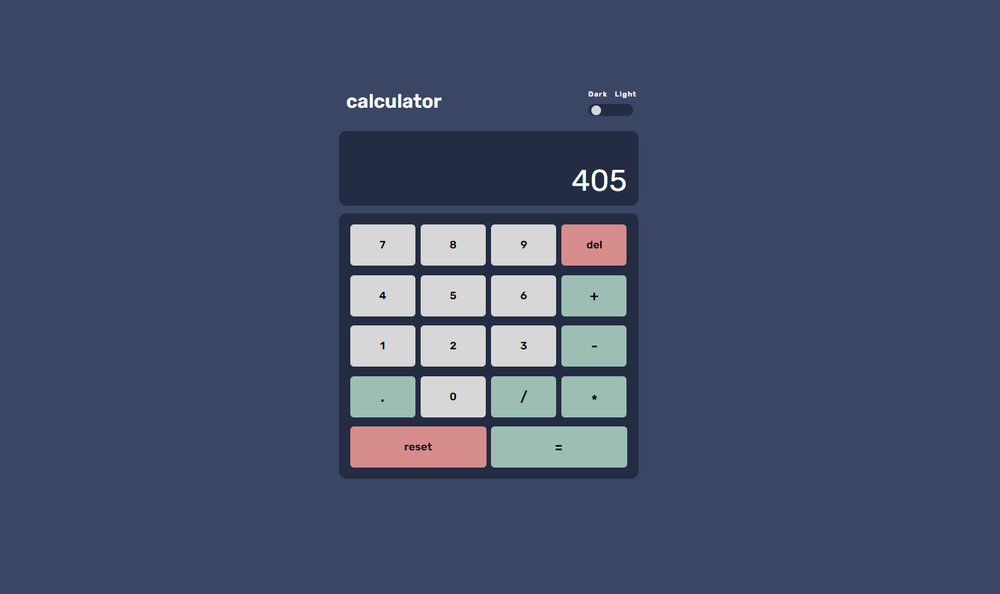

# Simple Calculator
> A calculator that performs simple expressions with a simple design and theme slider.  
> Live demo [_here_](https://bseright.github.io/calculator/).

## Table of Contents
* [General Info](#general-information)
* [Technologies Used](#technologies-used)
* [Features](#features)
* [Screenshots](#screenshots)
* [Room for Improvement](#room-for-improvement)
* [Contact](#contact)

## General Information
- Simple grid layout with styled keys to indicate operators and other functions. 
- Delete key removes the trailing character until none remain, leaving the current value at 0. 
- Decimal key prevents multiple decimal presses if the current value already contains a decimal.
- As expected, the reset key creates a new interaction with the calculator. 
- On any operator press, the previous entry and operator selection is stored and displayed. 
- Upon equal operator use, the calculated value remains for further manipulation. 
- Theme slider to allow dark and light theme for added styling variety. 

## Technologies Used
- HTML
- CSS
- Javascript

## Screenshots

## Room for Improvement
- Better represent the use of an actual calculator with a new keypress removing the stored value after equal operation. 
- Mobile responsiveness. 

## Contact
Created by Britain Seright ([@bseright](https://github.com/bseright))

Feel free to contact me!  
Email: britainseright@gmail.com